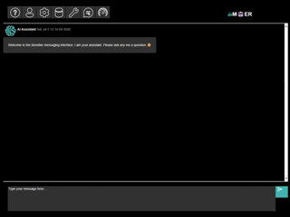
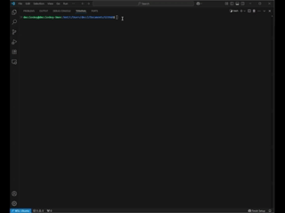

# PHYMES: Parallel HYpergraph MEssaging Streams

[](https://github.com/biom8er/phymes/actions/workflows/main.yml)
[](https://crates.io/crates/phymes-core)
[](https://docs.rs/phymes-core)
[](https://biom8er.github.io/phymes/)
[](https://github.com/biom8er/phymes/blob/main/LICENSE-MIT)
[](https://github.com/biom8er/phymes/blob/main/LICENSE-APACHE)

<!--- ANCHOR: introduction --->

## Introduction

🤔 What is PHYMES?

PHYMES (Parallel HYpergraph MEssaging Streams) is a subject-based message passing algorithm based on directed hypergraphs which provide the expressivity needed to model the heterogeneity and complexity of the real world. More details in the [guide].

🤔 What can PHYMES do?

PHYMES can be used to build scalable Agentic AI workflows, (hyper)-graph algorithms, and world simulators. Examples for building a chat bot, a tool calling agent, and document RAG agent are provided using embedded token/tensor services or local/remote token/tensor services using OpenAI compatible APIs.

🤔 Why PHYMES?

🔐 written 100% in [Rust] for performance, safety, and security.<br>
🌎 deployable on any platform (Linux, MacOs, Win, Android, and iOS) and in the browser (WebAssembly).<br>
💪 scalable to massive data sets using columnar in memory format, parallel and stream native processing, and GPU acceleration.<br>
🧩 interoperable with existing stacks by interfacing with cross-platform [Arrow] and [WASM]/[WASI].<br>
🔎 instrumented with tracing and customizable metrics to debug (hyper-)graph workflows faster.<br>

🤔 Who and what inspired PHYMES?

PHYMES takes inspiration from real world networks including biological networks. The implementation of PHYMES takes inspiration from [DataFusion], [Pregel], and [PyG]. 

🙏 PHYMES would not be possible if it were not for the amazing open-sources projects that it is built on top of including [Arrow] and [Candle] with full-stack support from [Tokio], [Dioxus], and [Wasmtime].

[guide]: https://biom8er.github.io/phymes/
[Rust]: https://www.rust-lang.org/
[Arrow]: https://arrow.apache.org/
[Candle]: https://www.rust-lang.org/
[Tokio]: https://tokio.rs/
[Dioxus]: https://dioxuslabs.com/
[DataFusion]: https://github.com/apache/datafusion
[Pregel]: https://dl.acm.org/doi/10.1145/1807167.1807184
[PyG]: https://github.com/pyg-team/pytorch_geometric
[WASM]: https://webassembly.org/
[WASI]: https://github.com/WebAssembly/WASI
[contributing]: CONTRIBUTING.md

<!--- ANCHOR_END: introduction --->

<!--- ANCHOR: installation1 --->

## Installation

Precompiled bundles for different Arch, OS, CUDA versions, and Token and Tensor services (e.g. for Agentic AI workflows) are provided on the [releases] page. 

| Arch | OS | CUDA | Token service |
| ---- | -- | ---- | ------------- |
| x86_64-unknown-linux-gnu | ubuntu22.04, ubuntu24.04 | 12.6.2, 12.9.1 | candle, openai_api |
| wasm32-wasip2 | n/a | n/a | candle |
| wasm32-unknown-unknown | n/a | n/a | candle |

Token services for agentic AI workflows can embedded in the application using `candle` or accessed locally e.g., self-hosted NVIDIA NIMs docker containers or remotely e.g., OpenAI, NVIDIA NIMs, etc. that adhere to the OpenAI API schema using `openai_api`. Tensor services are embedded in the application using `candle` with CPU vectorization and GPU acceleration support.

To install the phymes application, download the precompiled bundle that matches your system and needs, and unzip the bundle. Double click on `phymes-server` to start the server. Navigate to http://127.0.0.1:4000/ to view the web application. 

<!--- ANCHOR_END: installation1 --->

[](https://biom8er.github.io/phymes/assets/2025-07-05_phymes-app_ui_1080p.mp4)

*Click to see the full video*

<!--- ANCHOR: installation2 --->

Alternatively, you can make REST API requests against the server using e.g., `curl`.

```bash
# Sign-in and get our JWT token
curl -X POST -u EMAIL:PASSWORD http://localhost:4000/app/v1/sign_in
# mock response {"email":"EMAIL","jwt":"JWTTOKEN","session_plans":["Chat","DocChat","ToolChat"]}

# View a subject table from the session state
curl -H "Content-Type: application/json" -H "Authorization: Bearer JWTTOKEN" -d '{"name":"","subject":"chat_processor_1","publisher":"EMAILChat","message":[],"update":"None","session_name":"EMAILChat","format":"Bytes","stream":false}' http://localhost:4000/app/v1/get_state

# Chat request
# Make the user query and encode into bytes
query_str=$(printf '[{"content":"Write a python function to count prime numbers","role":"user","timestamp":%s}]' "$(date +%s)")
query_bytes=$(echo -n "$query_str" | od -An -t u1)
query_array=$(echo "$query_bytes" | xargs | tr ' ' ',')

# Make the message to send to the server
# Be sure to replace EMAIL with your actual email!
# Note that the session_name = email + session_plan (which we also use for the publisher)
message=$(printf '{"name":"query","subject":"UserMessages","publisher":"EMAILChat","message":[%s],"update":{"Extend":{"table_name":"UserMessages"}},"session_name":"EMAILChat","format":"Bytes","stream":false}' "$query_array")

# Make the chat request to the server
# Be sure to replace JWTTOKEN with your actual JWT token!
curl -H "Content-Type: application/json" -H "Authorization: Bearer JWTTOKEN" -d $message http://localhost:4000/app/v1/chat
```

Before running the `phymes-server`, setup the environmental variables *as needed* to access the local or remote OpenAI API token service endpoints.

```bash
# OpenAI API Key
export OPENAI_API_KEY=sk-proj-...

# NVIDIA API Key
export NGC_API_KEY=nvapi-...

# URL of the local/remote TGI OpenAI or NIMs deployment
export CHAT_API_URL=http://0.0.0.0:8000/v1

# URL of the local/remote TEI OpenAI or NIMs deployment
export EMBED_API_URL=http://0.0.0.0:8001/v1
```

WASM builds of `phymes-server` can be ran as stateless functions for embedded application using [wasmtime] or serverless applications.

<!--- ANCHOR_END: installation2 --->

[](https://biom8er.github.io/phymes/assets/2025-07-05_phymes-app_server_1080p.mp4)

*Click to see the full video*

<!--- ANCHOR: installation3 --->

```bash
# Sign-in and get our JWT token
wasmtime phymes-server.wasm -- --route app/v1/sign_in --basic-auth EMAIL:PASSWORD
# mock response {"email":"EMAIL","jwt":"JWTTOKEN","session_plans":["Chat","DocChat","ToolChat"]}

# View a subject table from the session state
wasmtime --dir=$HOME/.cache target/wasm32-wasip2/release/phymes-server.wasm --route app/v1/get_state --bearer-auth JWTTOKEN --data '{"name":"","subject":"chat_processor_1","publisher":"EMAILChat","message":[],"update":"None","session_name":"EMAILChat","format":"Bytes","stream":false}'

# Chat request
# Be sure to replace JWTTOKEN with your actual JWT token!
# Note that message is the same as in the previous example
wasmtime --dir=$HOME/.cache target/wasm32-wasip2/release/phymes-server.wasm --route app/v1/chat --bearer-auth JWTTOKEN --data $message
```

The phymes application is available for desktop (Linux, Windows, MacOS) and mobile (Android, iOS), but requires building from source on the target platform (i.e., Linux for Linux desktop, Windows for Windows desktop, MacOS for MacOS desktop, Linux for Android, and MacOS for iOS). See [contributing] guide for detailed installation and build instructions.

[releases]: https://github.com/biom8er/phymes/releases
[Wasmtime]: https://github.com/bytecodealliance/wasmtime

<!--- ANCHOR_END: installation3 --->

<!--- ANCHOR: repository --->

## Repository

The [`phymes-core`], [`phymes-ml`], [`phymes-data`], [`phymes-agents`], [`phymes-server`], [`phymes-app`] crates form a full-stack application that can run Agentic AI workflows, (Hyper-)Graph algorithms, and/or Simulate complex real world networks at scale using a web, desktop, or mobile interface.

| Crate | Description | Latest API Docs | README |
| ----- | ----------- | --------------- | ------ |
| [`phymes-core`] | Core hypergraph messaging functionality | [docs.rs](https://docs.rs/phymes-core/latest) | [README](phymes-core/README.md) |
| [`phymes-ml`] | Support for machine learning (ML) and generative artificial intelligence (AI) | [docs.rs](https://docs.rs/phymes-ml/latest) | [README](phymes-ml/README.md) |
| [`phymes-data`] | Support for GPU accelerated data wrangling | [docs.rs](https://docs.rs/phymes-data/latest) | [README](phymes-data/README.md) |
| [`phymes-agents`] | Templates for building Agentic AI hypergraph messaging applications | [docs.rs](https://docs.rs/phymes-agents/latest) | [README](phymes-agents/README.md) |
| [`phymes-server`] | Server that runs the Agentic AI hypergraph messaging services  | [docs.rs](https://docs.rs/phymes-server/latest) | [README](phymes-server/README.md) |
| [`phymes-app`] | Frontend UI for dynamically interacting with the Agentic AI hypergraph messaging services  | [docs.rs](https://docs.rs/phymes-app/latest) | [README](phymes-app/README.md) |

[`phymes-core`]: https://crates.io/crates/phymes-core
[`phymes-ml`]: https://crates.io/crates/phymes-ml
[`phymes-data`]: https://crates.io/crates/phymes-data
[`phymes-agents`]: https://crates.io/crates/phymes-agents
[`phymes-server`]: https://crates.io/crates/phymes-server
[`phymes-app`]: https://crates.io/crates/phymes-app

<!--- ANCHOR_END: repository --->

## Roadmap

1. More examples for running hypergraph algorithms and simulators using `phymes-core`, and production agentic AI examples e.g., NVIDIA RAG [Blue Print](https://github.com/NVIDIA-AI-Blueprints/rag) within `phymes-agent`.
2. Improved GPU accelerated Data operators including joins and aggregations [see](https://arxiv.org/pdf/2312.00720)
3. Better test coverage of `phymes-server` and `phymes-app` which also require a refactor particularly of `phymes-app` components
4. Proper application database and sign-in user journey
5. Better OpenAI (and non-OpenAI) API token service coverage e.g. [rust-genai], support for building Model Context Provider ([MCP]) e.g. [rust-sdk], and integrations with other external databases e.g. [rig]
6. See [issues] for more...

[rust-genai]: https://github.com/jeremychone/rust-genai
[MCP]: https://modelcontextprotocol.io/specification
[rust-sdk]: https://github.com/modelcontextprotocol/rust-sdk
[rig]: https://github.com/0xPlaygrounds/rig

## Community

The best place to engage with the Biom8er phymes community is on [GitHub Discussions][discussions]. New features and bug fix requests should be submitted via [GitHub issues][issues] which acts as the system of record for development. Design and more technical discussions should also take place on GitHub issues.

[issues]: https://github.com/apache/arrow-rs/issues
[discussions]: https://github.com/apache/arrow-rs/discussions