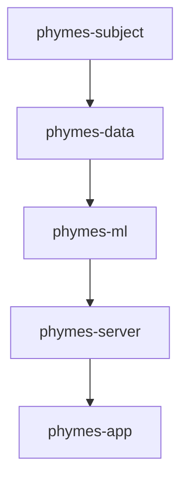

# Getting started

This user guide will cover how to install the full-stack phymes application, develop with phymes, and deploy applications with phymes.

```mermaid
flowchart TD
	phymes-subject-->phymes-data
	phymes-data-->phymes-ml
	phymes-ml-->phymes-server
	phymes-server-->phymes-app
```