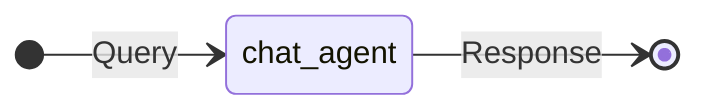
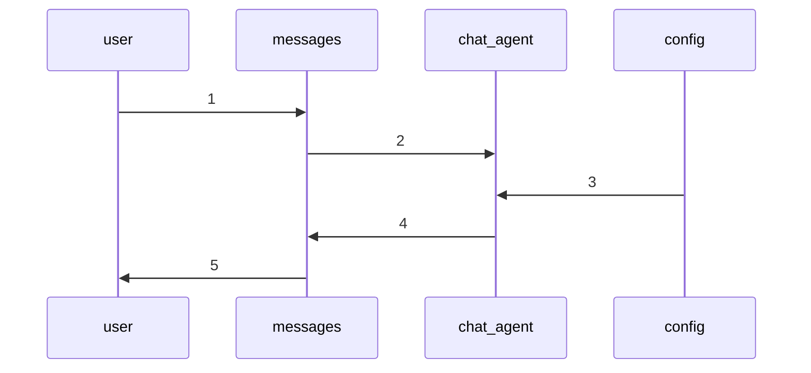
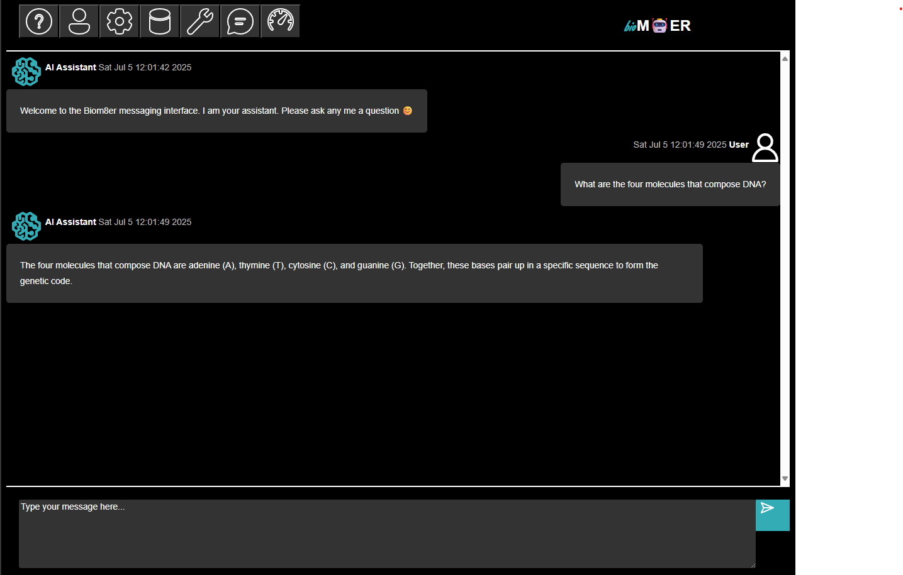

# Session Plan: Chat Agent

## Synopsis

This tutorial describes how the [Chat Agent Session Plan](../../../phymes-agents/src/session_plans/chat_agent_session.rs) uses the [phymes-agent](../../../phymes-agents/README.md) and [phymes-core](../../../phymes-core/README.md) crates to build a simple chat agent. The `chat agent` is provided in the [examples](../../../phymes-agents/examples/chatagent/main.rs).

## Tutorial

The simplest agentic AI architecture is that of a chat agent, which can be modeled as a static directed acyclic graph.

The session starts with a query to the chat_agent from the user, and the chat_agent runs text generation inference to respond back to the user.

Under the hood, the states of the application are determined by the subjects that are subscribed to and published on by the user and the chat_agent.

The sequence of actions are the following:

1. The user publishes to messages subject
2. The chat_agent subscribes to messages subject when there is a change to the messages subject table.
3. The chat_agent subscribes to configs subject no matter if there is a change or not because the configs provide the parameters for running the chat_agent.
4. The chat_agent performs text generation inference based on the messages subject content and publishes the results to the messages subject.
5. The user subscribes to messages subject where there is a change to the messages subject table.

The session ends because there are no further updates to the subjects. If the user publishes a follow-up message, the session will pick-up where it left off with the chat_agent responding to the updated message content.

## Next steps

The [Chat Agent Session Plan](../../../phymes-agents/src/session_plans/chat_agent_session.rs) comes with a number of default configurations including the model, number of tokens to sample, temperature of sampling, etc. that can be modified by the user.