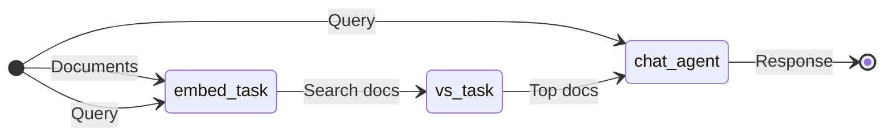
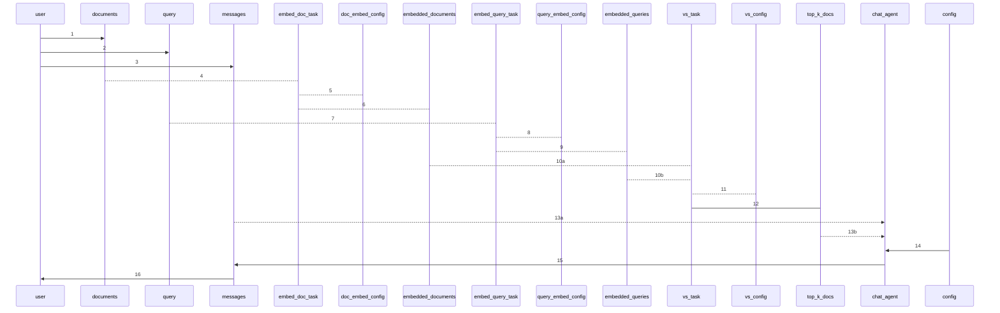
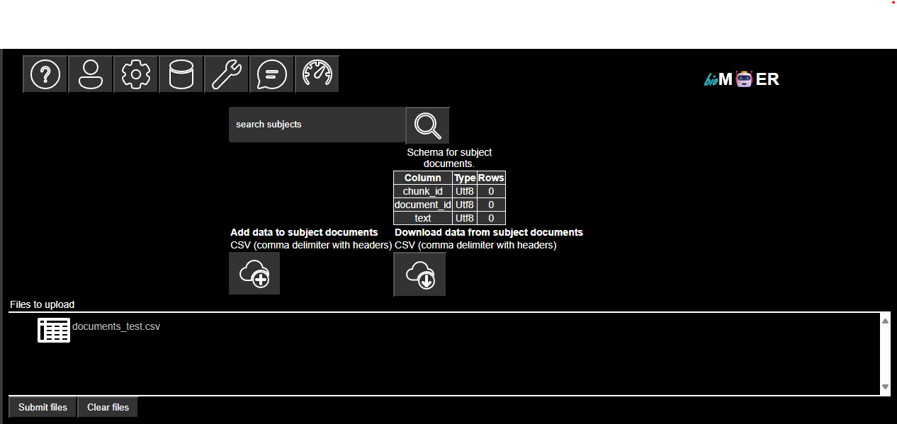
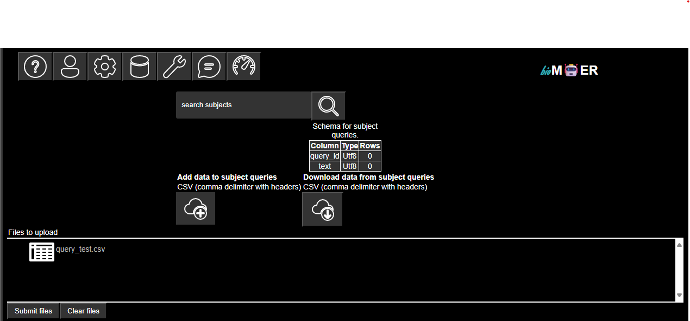
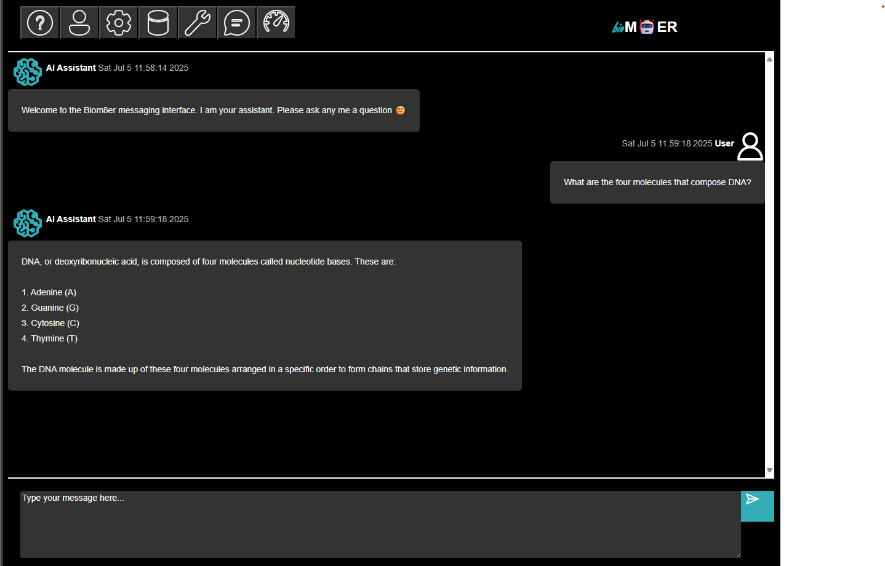

# Seesion Plan: Retrieval Augmented Generation (RAG) Agent
## Synopsis

This tutorial describes how the [Document RAG Agent Session Plan](../../../phymes-agents/src/session_plans/document_rag_session.rs) uses the [phymes-agent](../../../phymes-agents/README.md) and [phymes-core](../../../phymes-core/README.md) crates to build a tool calling agent.

## Tutorial

The document RAG agent adds a complex document parsing, embedding, and retrieval ETL pipeline to the agentic AI architecture of the chat agent.

The session starts with an upload of documents to the embed_task to chunk and embed the documents, an upload of the query to the embed_task to embed the query, and a query to the chat_agent from the user. Next, a vector search is performed over the embedded documents to find the top K documents matching the query. Finally, the top K documents are provided to the chat_agent to ground the text generation inference to respond back to the user.

Under the hood, the states of the application are determined by the subjects that are subscribed to and published on by the user, embed_task, vs_task, and chat_agent.

The sequence of actions are the following:

1. The user publishes to documents subject

2. The user publishes to query subject

3. The user publishes to messages subject
4. The embed_doc_task subscribes to the documents subject when there is a change to the documents subject table
5. The embed_doc_task subscribes to configs subject no matter if there is a change or not because the configs provide the parameters for running the chunk_processor.
6. The embed_doc_task chunks the documents, embeds the chunks, and publishes the results to the embedded_documents subject.
7. The embed_query_task subscribes to the documents subject when there is a change to the documents subject table
8. The embed_query_task subscribes to configs subject no matter if there is a change or not because the configs provide the parameters for running the chunk_processor.
9. The embed_query_task embeds the query and publishes the results to the embedded_queries subject.
10. The vs_task subscribes to the embedded_documents and embedded_queries subjects when there is a change to the embedded_documents and embedded_queries subject tables
11. The vs_task subscribes to configs subject no matter if there is a change or not because the configs provide the parameters for running the chunk_processor.
12. The vs_task computes the relative similarity between the query and document embeddings, sorts the scores in descending order, retrieves the chunk text, formats the results for RAG, and publishes the results to the top_k_docs subject.
13. The chat_agent subscribes to messages and top_k_docs subjects when there is a change to the messages and top_k_docs subject tables.
14. The chat_agent subscribes to configs subject no matter if there is a change or not because the configs provide the parameters for running the chat_agent.
15. The chat_agent performs text generation inference based on the messages subject content and retrieved Top K document chunks, and publishes the results to the messages subject.
16. The user subscribes to messages subject where there is a change to the messages subject table.

The session ends because there are no further updates to the subjects. If the user publishes a follow-up message or uploads new documents, the session will pick-up where it left off with the chat_agent responding to the updated message and top k document chunk content.

## Next steps

The [Document RAG Agent Session Plan](../../../phymes-agents/src/session_plans/document_rag_agent_session.rs) comes with a number of default configurations including the model, number of tokens to sample, temperature of sampling, etc. that can be modified by the user. For production use cases, we recommend the NVIDIA RAG [Blue Print](https://github.com/NVIDIA-AI-Blueprints/rag).