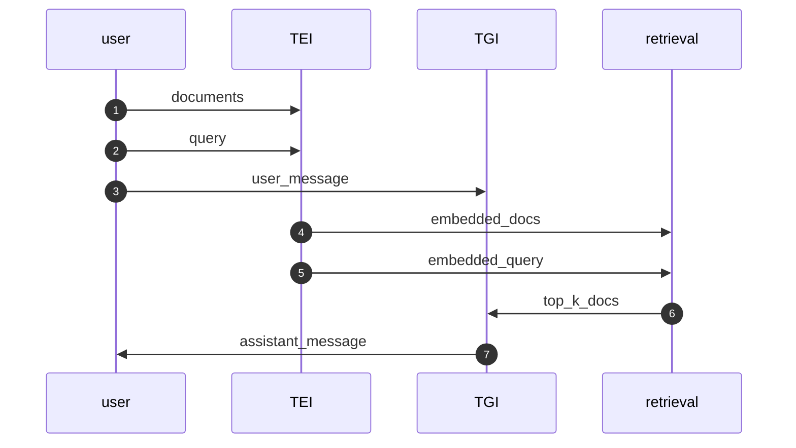
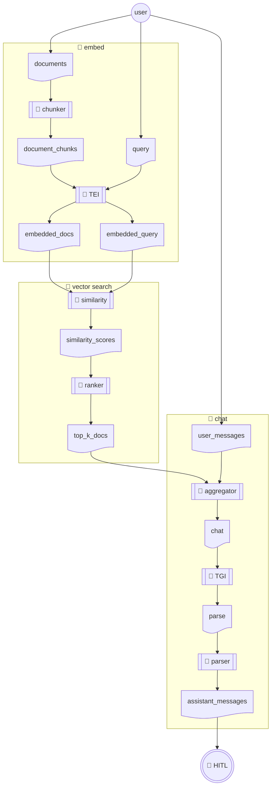

# Seesion Plan: Retrieval Augmented Generation (RAG) Agent
## Synopsis

This tutorial describes how the [Document RAG Agent Session Plan](https://github.com/biom8er/phymes/blob/main/phymes-agents/src/session_plans/document_rag_session.rs) uses the [phymes-agent](https://github.com/biom8er/phymes/blob/main/phymes-agents/README.md) and [phymes-core](https://github.com/biom8er/phymes/blob/main/phymes-core/README.md) crates to build a tool calling agent.

## Tutorial

The document RAG agent adds a complex document parsing, embedding, and retrieval Data pipeline to the agentic AI architecture of the chat agent.

```mermaid
sequenceDiagram
    autonumber
    user ->> TEI: documents
    user ->> TEI: query 
    user ->> TGI: user_message
    TEI ->> retrieval: embedded_docs
    TEI ->> retrieval: embedded_query
    retrieval ->> TGI: top_k_docs
    TGI ->> user: assistant_message
```

The session is composed of 4 tasks: 1. the user, 2. Text embedding inference (TEI), 3. Retrieval, and 4. Text generation inference (TGI). 

The session starts when the user upload documents documents (1), and their query (2 and 3) to the session.

The TEI task then chunks the documents, and embeds the chunks and query (4 and 5). The Retrieval task finds the document chunks that best match the query and returns the top K chunks (6). The TGI task generates a response for the user based on the top K chunks and the query (7).

The session ends when there are no further updates to the subjects. If the user publishes a follow-up message or uploads new documents, the session will pick-up where it left off.

```mermaid
flowchart TD
    user@{ shape: circle, label: user } --> documents@{ shape: doc, label: documents }
    user@{ shape: circle, label: user } --> query@{ shape: doc, label: query }
    user@{ shape: circle, label: user } --> user_messages@{ shape: doc, label: user_messages }
    subgraph "🤖 embed"
        documents@{ shape: doc, label: documents } --> chunker@{ shape: subproc, label: 🔨 chunker }
        chunker@{ shape: subproc, label: 🔨 chunker } --> document_chunks@{ shape: doc, label: document_chunks }
        document_chunks@{ shape: doc, label: document_chunks } --> TEI@{ shape: subproc, label: 🧠 TEI }
        TEI@{ shape: subproc, label: 🧠 TEI } --> embedded_docs@{ shape: doc, label: embedded_docs }
        query@{ shape: doc, label: query } --> TEI@{ shape: subproc, label: 🧠 TEI }
        TEI@{ shape: subproc, label: 🧠 TEI } --> embedded_query@{ shape: doc, label: embedded_query }
    end
    subgraph "🤖 vector search"
        embedded_docs@{ shape: doc, label: embedded_docs } --> similarity@{ shape: subproc, label: 🔨 similarity }
        embedded_query@{ shape: doc, label: embedded_query } --> similarity@{ shape: subproc, label: 🔨 similarity }
        similarity@{ shape: subproc, label: 🔨 similarity } --> similarity_scores@{ shape: doc, label: similarity_scores }
        similarity_scores@{ shape: doc, label: similarity_scores } --> ranker@{ shape: subproc, label: 🔨 ranker }
        ranker@{ shape: subproc, label: 🔨 ranker } --> top_k_docs@{ shape: doc, label: top_k_docs }
    end
    subgraph "🤖 chat"
        top_k_docs@{ shape: doc, label: top_k_docs } --> aggregator@{ shape: subproc, label: 🔨 aggregator }
        user_messages@{ shape: doc, label: user_messages } --> aggregator@{ shape: subproc, label: 🔨 aggregator }
        aggregator@{ shape: subproc, label: 🔨 aggregator } --> c@{ shape: doc, label: chat }
        c@{ shape: doc, label: chat } --> TGI@{ shape: subproc, label: 🧠 TGI }
        TGI@{ shape: subproc, label: 🧠 TGI } --> parse@{ shape: doc, label: parse }
        parse@{ shape: doc, label: parse } --> parser@{ shape: subproc, label: 🔨 parser }
        parser@{ shape: subproc, label: 🔨 parser } --> assistant_messages@{ shape: doc, label: assistant_messages }
    end
    assistant_messages@{ shape: doc, label: assistant_messages } --> HITL@{ shape: dbl-circ, label: 👤 HITL }
```

Under the hood, the states of the application are determined by the subjects that are subscribed to and published on by the User, TEI, Retrieval, and TGI tasks. Each task is composed of one or more processes that are chained together to execute the task. Each processor listens for changes on their subscribed subjects and publishes their results to subjects. Each task runs once the subscription criteria for all of its child processors are satisfied.

At each superstep of the session, subscribed subjects are allocated to tasks, tasks are ran in parallel, and the subjects for which tasks publish on are updated sequentially.

While not shown in the flowchart above, each processor subscribes to a special subject usually called the config which specifies all of the parameters for the processor. And like any other subject, the config can also be updated dynamically during the execution of the session.

The decision to chain multiple processors into a single task or to allocated each processor to its own task is up to the needs of the user. Chaining multple processors can be more performant and efficient because fewer subscription and publishing copies and updates, respectively are needed. However, allocating each processor to its own task is easier to debug since the output of each task can be easily verified. Also, any processor that requires an external API call has to be allocated to its own task as chaining of streams breaks the poll on the external API call.

## Next steps

The [Document RAG Agent Session Plan](https://github.com/biom8er/phymes/blob/main/phymes-agents/src/session_plans/document_rag_agent_session.rs) comes with a number of default configurations including the model, number of tokens to sample, temperature of sampling, etc. that can be modified by the user. The session plan can be used with embedded Candle models or OpenAI API endpoints for token services.