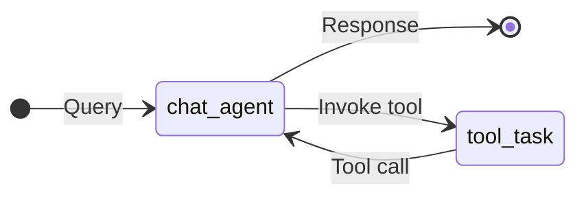
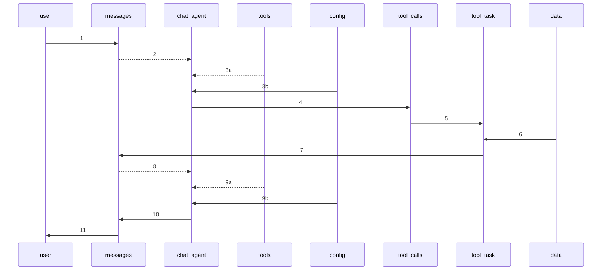

# Session Plan: Tool Agent
## Synopsis

This tutorial describes how the [Tool Agent Session Plan](../../../phymes-agents/src/session_plans/tool_agent_session.rs) uses the [phymes-agent](../../../phymes-agents/README.md) and [phymes-core](../../../phymes-core/README.md) crates to build a tool calling agent.

## Tutorial

The tool agent adds stochasticity to the agentic AI architecture of the chat agent by conditionally calling an external tool if needed, which can be modeled as a conditional directed cyclic graph.

The session starts with a query to the chat_agent from the user. Next, the chat_agent may call one or more tools to answer the user query. Next, the tool calls are executed in parallel by the tool_task. Finally, the results of the tool calls are provided to the chat_agent to ground the text generation inference to respond back to the user.

Under the hood, the states of the application are determined by the subjects that are subscribed to and published on by the user, tool_task and chat_agent.

The sequence of actions are the following:

1. The user publishes to messages subject
2. The chat_agent subscribes to messages subject when there is a change to the messages subject table.
3. The chat_agent subscribes to configs and tools subjects no matter if there is a change or not because the configs provide the parameters for running the chat_agent and the tools describes the schema for the tool calls.
4. The chat_agent performs text generation inference based on the messages subject content and tool schemas, and publishes the results to either messages or tool_calls subject.
5. The tool_task subscribes to the tool_calls subject when there is a change to the tool_calls subject table
6. The tool_task subscribes to the data subject (one or more data tables needed to execute the tool call) no matter if there is a change or not because the data subjects provide the data tables needed for running the tool_task.
7. The tool_task retrieves the needed data tables to execute the tool_calls, executes the tool_calls, and publishes the results to the messages subject.
8. The chat_agent subscribes to messages subject when there is a change to the messages subject table, which has now been updated with the results of the tool_calls.
9. The chat_agent subscribes to configs and tools subjects no matter if there is a change or not because the configs provide the parameters for running the chat_agent and the tools describes the schema for the tool calls.
10. The chat_agent performs text generation inference based on the messages subject content, tool schemas, and results of the tool_calls, and publishes the results to either messages or tool_calls subject.
11. The user subscribes to messages subject where there is a change to the messages subject table.

The session ends because there are no further updates to the subjects. If the user publishes a follow-up message the session will pick-up where it left off with the chat_agent responding to the updated message and tool_calls content.

## Next steps

The [Tool Agent Session Plan](../../../phymes-agents/src/session_plans/tool_agent_session.rs) comes with a number of default configurations including the model, number of tokens to sample, temperature of sampling, etc. that can be modified by the user. A trivial use case is provided for sorting an array in a table that can be used as a starting point for creating more complex realistic use cases involving tools that manipulate (large) tabular data.