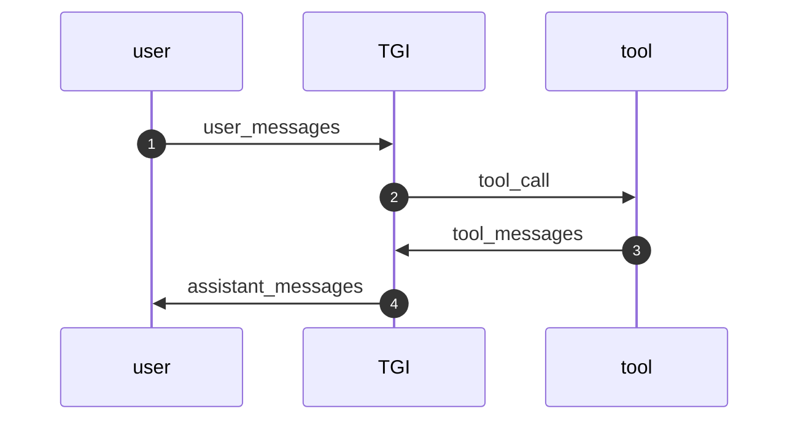
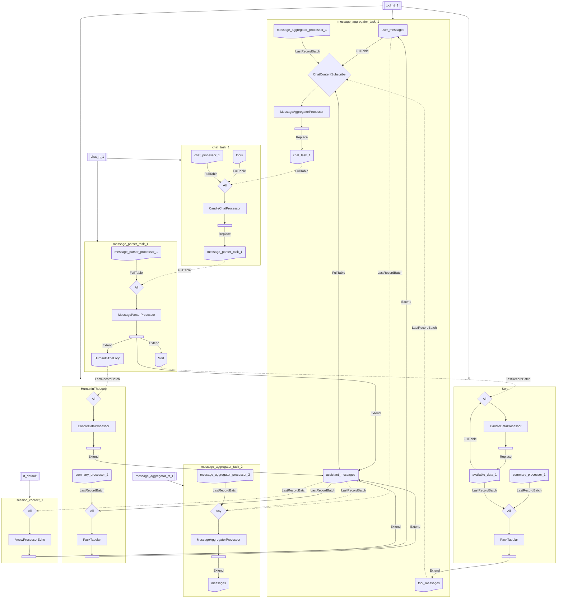

# Session Plan: Tool Agent
## Synopsis

This tutorial describes how the [Tool Agent Session Plan](https://github.com/biom8er/phymes/blob/main/phymes-agents/src/session_plans/tool_agent_session.rs) uses the [phymes-agent](https://github.com/biom8er/phymes/blob/main/phymes-agents/README.md) and [phymes-core](https://github.com/biom8er/phymes/blob/main/phymes-core/README.md) crates to build a tool calling agent.

## Tutorial

The tool agent adds stochasticity to the agentic AI architecture of the chat agent by conditionally calling an external tool if needed, which can be modeled as a conditional directed cyclic graph.

```mermaid
sequenceDiagram
    autonumber
    user ->> TGI: user_messages
    TGI ->> tool: tool_call
	tool ->> TGI: tool_messages
    TGI ->> user: assistant_messages
```

The session is composed of 4 tasks: 1. the user, 2. Text embedding inference (TEI), 3. Retrieval, and 4. Text generation inference (TGI). 

The session starts when the user publishes a query (1) to the session. The TGI task either generates one or more structured tool_call response (2) or an unstructured response for the user (4) based on the query and available tools. The tool task executes all tool_call messages and publishes their results in parallel (3). The TGI and tool tasks (2 and 3) are repeated until the TGI task decides to respond to the user. The session ends when there are no further updates to the subjects. If the user publishes a follow-up message, the session will pick-up where it left off.

```mermaid
flowchart TD
	subgraph message_aggregator_task_1
		user_messages-subject--FullTable-->message_aggregator_processor_1-subscribe
		tool_messages-subject-.LastRecordBatch.->message_aggregator_processor_1-subscribe
		assistant_messages-subject--FullTable-->message_aggregator_processor_1-subscribe
		message_aggregator_processor_1-subject--LastRecordBatch-->message_aggregator_processor_1-subscribe
		message_aggregator_processor_1-subscribe-->message_aggregator_processor_1-processor
		message_aggregator_processor_1-processor-->message_aggregator_processor_1-publish
		message_aggregator_processor_1-publish--Replace-->chat_task_1-subject
	end
	subgraph message_aggregator_task_2
		user_messages-subject-.LastRecordBatch.->message_aggregator_processor_2-subscribe
		assistant_messages-subject-.LastRecordBatch.->message_aggregator_processor_2-subscribe
		message_aggregator_processor_2-subject--LastRecordBatch-->message_aggregator_processor_2-subscribe
		message_aggregator_processor_2-subscribe-->message_aggregator_processor_2-processor
		message_aggregator_processor_2-processor-->message_aggregator_processor_2-publish
		message_aggregator_processor_2-publish--Extend-->messages-subject
	end
	subgraph chat_task_1
		chat_task_1-subject-.FullTable.->chat_processor_1-subscribe
		tools-subject--FullTable-->chat_processor_1-subscribe
		chat_processor_1-subject--FullTable-->chat_processor_1-subscribe
		chat_processor_1-subscribe-->chat_processor_1-processor
		chat_processor_1-processor-->chat_processor_1-publish
		chat_processor_1-publish--Replace-->message_parser_task_1-subject
	end
	subgraph message_parser_task_1
		message_parser_task_1-subject-.FullTable.->message_parser_processor_1-subscribe
		message_parser_processor_1-subject--FullTable-->message_parser_processor_1-subscribe
		message_parser_processor_1-subscribe-->message_parser_processor_1-processor
		message_parser_processor_1-processor-->message_parser_processor_1-publish
		message_parser_processor_1-publish--Extend-->assistant_messages-subject
		message_parser_processor_1-publish--Extend-->Sort-subject
		message_parser_processor_1-publish--Extend-->HumanInTheLoop-subject
	end
	subgraph Sort
		Sort-subject-.LastRecordBatch.->Sort-subscribe
		available_data_1-subject--FullTable-->Sort-subscribe
		Sort-subscribe-->Sort-processor
		Sort-processor-->Sort-publish
		Sort-publish--Replace-->available_data_1-subject
		summary_processor_1-subject--LastRecordBatch-->summary_processor_1-subscribe
		available_data_1-subject--LastRecordBatch-->summary_processor_1-subscribe
		summary_processor_1-subscribe-->summary_processor_1-processor
		summary_processor_1-processor-->summary_processor_1-publish
		summary_processor_1-publish--Extend-->tool_messages-subject
	end
	subgraph HumanInTheLoop
		HumanInTheLoop-subject-.LastRecordBatch.->HumanInTheLoop-subscribe
		HumanInTheLoop-subscribe-->HumanInTheLoop-processor
		HumanInTheLoop-processor-->HumanInTheLoop-publish
		HumanInTheLoop-publish--Extend-->assistant_messages-subject
		summary_processor_2-subject--LastRecordBatch-->summary_processor_2-subscribe
		assistant_messages-subject--LastRecordBatch-->summary_processor_2-subscribe
		summary_processor_2-subscribe-->summary_processor_2-processor
		summary_processor_2-processor-->summary_processor_2-publish
		summary_processor_2-publish--Extend-->assistant_messages-subject
	end
	subgraph session_context_1
		assistant_messages-subject-.LastRecordBatch.->session_context_1-subscribe
		session_context_1-subscribe-->session_context_1-processor
		session_context_1-processor-->session_context_1-publish
		session_context_1-publish--Extend-->user_messages-subject
		session_context_1-publish--Extend-->assistant_messages-subject
	end
	tool_rt_1-rt-->message_aggregator_task_1
	message_aggregator_rt_1-rt-->message_aggregator_task_2
	chat_rt_1-rt-->chat_task_1
	chat_rt_1-rt-->message_parser_task_1
	tool_rt_1-rt-->Sort
	tool_rt_1-rt-->HumanInTheLoop
	rt_default-rt-->session_context_1
	message_aggregator_processor_1-processor@{shape: rect, label: MessageAggregatorProcessor}
	message_aggregator_processor_2-processor@{shape: rect, label: MessageAggregatorProcessor}
	chat_processor_1-processor@{shape: rect, label: CandleChatProcessor}
	message_parser_processor_1-processor@{shape: rect, label: MessageParserProcessor}
	Sort-processor@{shape: rect, label: CandleDataProcessor}
	HumanInTheLoop-processor@{shape: rect, label: CandleDataProcessor}
	summary_processor_1-processor@{shape: rect, label: PackTabular}
	summary_processor_2-processor@{shape: rect, label: PackTabular}
	session_context_1-processor@{shape: rect, label: ArrowProcessorEcho}
	chat_rt_1-rt@{shape: subproc, label: chat_rt_1}
	message_aggregator_rt_1-rt@{shape: subproc, label: message_aggregator_rt_1}
	rt_default-rt@{shape: subproc, label: rt_default}
	tool_rt_1-rt@{shape: subproc, label: tool_rt_1}
	HumanInTheLoop-subject@{shape: doc, label: HumanInTheLoop}
	Sort-subject@{shape: doc, label: Sort}
	assistant_messages-subject@{shape: doc, label: assistant_messages}
	available_data_1-subject@{shape: doc, label: available_data_1}
	chat_processor_1-subject@{shape: doc, label: chat_processor_1}
	chat_task_1-subject@{shape: doc, label: chat_task_1}
	message_aggregator_processor_1-subject@{shape: doc, label: message_aggregator_processor_1}
	message_aggregator_processor_2-subject@{shape: doc, label: message_aggregator_processor_2}
	message_parser_processor_1-subject@{shape: doc, label: message_parser_processor_1}
	message_parser_task_1-subject@{shape: doc, label: message_parser_task_1}
	messages-subject@{shape: doc, label: messages}
	summary_processor_1-subject@{shape: doc, label: summary_processor_1}
	summary_processor_2-subject@{shape: doc, label: summary_processor_2}
	tool_messages-subject@{shape: doc, label: tool_messages}
	tools-subject@{shape: doc, label: tools}
	user_messages-subject@{shape: doc, label: user_messages}
	HumanInTheLoop-publish@{shape: fork}
	Sort-publish@{shape: fork}
	chat_processor_1-publish@{shape: fork}
	message_aggregator_processor_1-publish@{shape: fork}
	message_aggregator_processor_2-publish@{shape: fork}
	message_parser_processor_1-publish@{shape: fork}
	session_context_1-publish@{shape: fork}
	summary_processor_1-publish@{shape: fork}
	summary_processor_2-publish@{shape: fork}
	HumanInTheLoop-subscribe@{shape: diamond, label: All}
	Sort-subscribe@{shape: diamond, label: All}
	chat_processor_1-subscribe@{shape: diamond, label: All}
	message_aggregator_processor_1-subscribe@{shape: diamond, label: ChatContentSubscribe}
	message_aggregator_processor_2-subscribe@{shape: diamond, label: Any}
	message_parser_processor_1-subscribe@{shape: diamond, label: All}
	session_context_1-subscribe@{shape: diamond, label: All}
	summary_processor_1-subscribe@{shape: diamond, label: All}
	summary_processor_2-subscribe@{shape: diamond, label: All}
```

Under the hood, the states of the application are determined by the subjects that are subscribed to and published on by the User, Tool, and TGI tasks. Each task is composed of one or more processes that are chained together to execute the task. Each processor listens for changes on their subscribed subjects and publishes their results to subjects. Each task runs once the subscription criteria for all of its child processors are satisfied.

At each superstep of the session, subscribed subjects are allocated to tasks, tasks are ran in parallel, and the subjects for which tasks publish on are updated sequentially.

While not shown in the flowchart above, each processor subscribes to a special subject usually called the config which specifies all of the parameters for the processor. And like any other subject, the config can also be updated dynamically during the execution of the session.

The decision to chain multiple processors into a single task or to allocated each processor to its own task is up to the needs of the user. Chaining multple processors can be more performant and efficient because fewer subscription and publishing copies and updates, respectively are needed. However, allocating each processor to its own task is easier to debug since the output of each task can be easily verified. Also, any processor that requires an external API call has to be allocated to its own task as chaining of streams breaks the poll on the external API call.

## Next steps

The [Tool Agent Session Plan](https://github.com/biom8er/phymes/blob/main/phymes-agents/src/session_plans/tool_agent_session.rs) comes with a number of default configurations including the model, number of tokens to sample, temperature of sampling, etc. that can be modified by the user. A trivial use case is provided for sorting an array in a table that can be used as a starting point for creating more complex realistic use cases involving tools that manipulate (large) tabular data.