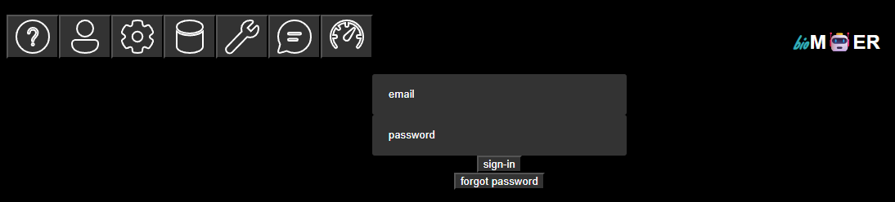
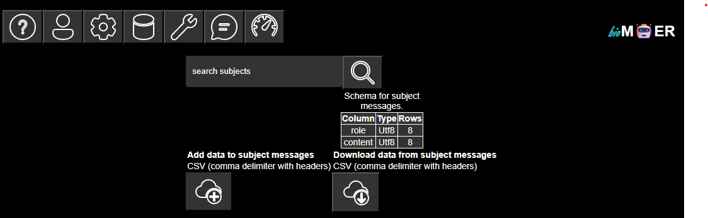
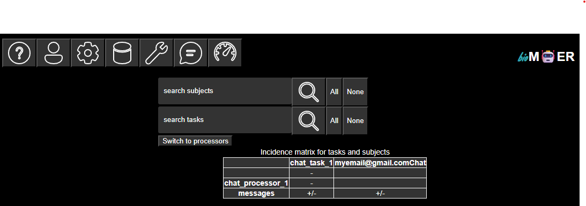
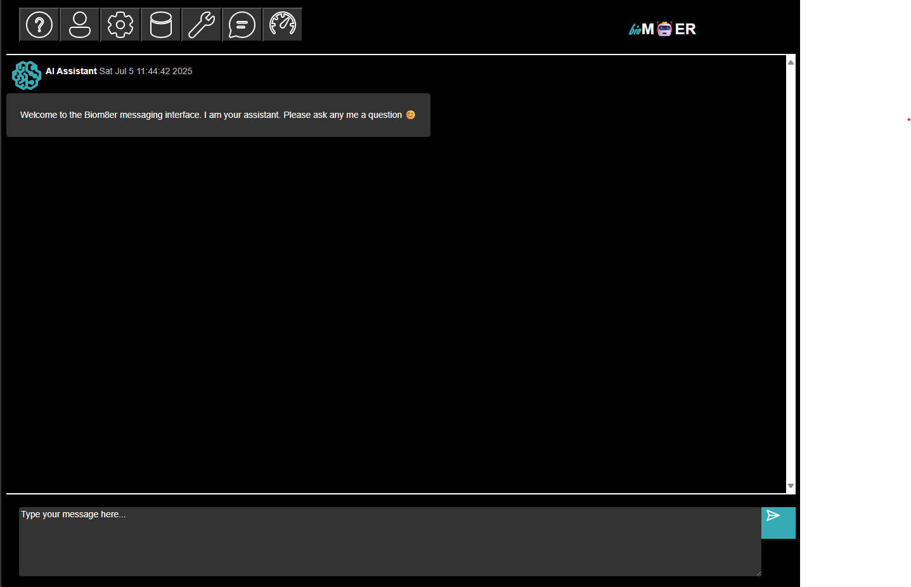
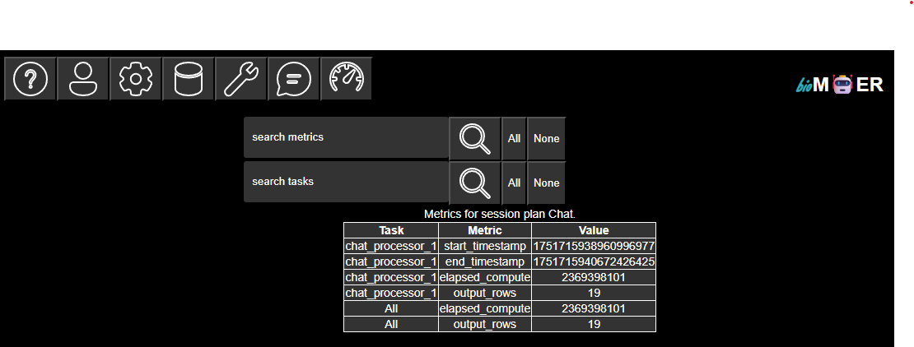

# User Interface (UI)
## Main menu
### Help

Description of menu items

### Sign in

User registration and sign in. Each account corresponds to a single email.

### Session plans

A list of session plans available to the account. Each session is like a different app with different functionality and state. Only one session can be activated at a time.

### Subjects

A list of subject associated with the active session plan. A table shows the schema of the subject tables along with the number if rows. The subject tables can be extended by uploading tables in comma deliminated CSV format with headers that match the subject. The subject tables can also be downloaded in comma deliminated CSV format. Note that all of the parameters for describing how processors process streaming messages are subject tables. Extending the subject tables for a processors parameters will update the processors parameters on the next run. Note that the message history is also a subject table. Extending the messages table is the equivalent of human in the loop.

### Tasks

A list of tasks and subjects that the tasks subscribe to and publish on associated with the active session plan. The reaction between tasks and subjects are visualized as an incidence matrix where + indicates publish on and - indicates subscribe to. A toggle button is provided to expand the tasks to their individual processors and collapse the individual processors to their tasks.

### Messaging

The message history for the active session plan. A chat interface is provided for users to publish messages to the messages subject and to receive subscriptions from the messages subject when the messages subject is updated. 

### Metrics

A list of metrics associated with the active session plan. Metrics are tracked per processor. A table in long form displays the values for the tracked metrics. Baseline metrics for row count, and processor start, stop, and total time in nanoseconds are provided. Note each row is approximately one token for text generation inference processors. Please submit a feature request issue if additional metrics are of interest. 